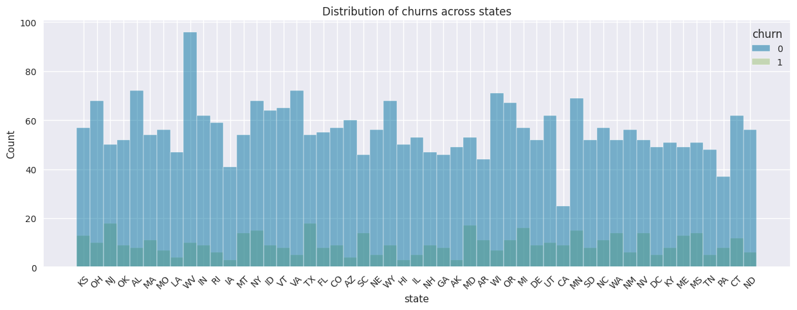

# **Predicting Customer Churn for SyriaTel Telecommunications**

# Project Overview
The primary objective of this project is to build a robust binary classification model to predict whether a customer is likely to terminate their services with SyriaTel, a leading telecommunications company. This predictive model aims to assist the telecom business in minimizing revenue loss associated with customer churn by identifying patterns that may indicate potential disengagement.

# Business Understanding
Business understanding is fundamental for SyriaTel, a telecommunications company, aiming to effectively address customer churn and optimize revenue. This understanding forms the cornerstone for strategic decision-making and sustainable growth in the competitive telecom industry. The project revolves around predicting customer churn and involves a comprehensive comprehension of the factors influencing customer behavior. Key considerations include:

- I. Usage Patterns:
Understanding the size and nature of customer usage, including call duration, data usage, and service subscriptions, is crucial. High usage patterns might indicate customer satisfaction, while sudden drops could signal potential churn.
- II. Billing Information:
Analyzing billing data, such as the types of plans customers are subscribed to, payment history, and any irregularities in billing patterns, can provide insights into financial aspects influencing customer decisions.

# Data understanding 
In this data science project, we are provided with a dataset containing information on 3333 telecom customers, organized into 21 columns. The dataset includes both categorical and numerical features, providing a comprehensive overview of customer behavior and usage patterns.

Categorical features such as "state," "international plan," and "voice mail plan" provide insights into the geographic distribution of customers and their subscription plans. Meanwhile, numerical features like "account length," "total day minutes," and "customer service calls" offer quantitative metrics to analyze customer engagement and satisfaction.

The dataset seems to be well-prepared, with no missing values across all columns. The "churn" column, represented as a boolean, will likely serve as the target variable, indicating whether a customer has discontinued their service.

Each customer's phone number is also included, but its role in the analysis might be limited, considering its uniqueness for each entry. The "area code" column, representing the geographic area of the customer, adds another layer of granularity to the analysis.

The numerical columns, such as "total day minutes" and "total intl charge," offer a rich set of features to explore customer usage patterns throughout different times of the day and international calling behavior. The "customer service calls" column is particularly interesting as it provides insight into customer satisfaction and potential issues requiring resolution.

Understanding these features lays the foundation for further exploration and analysis. As we progress through the data science project, we can delve into exploratory data analysis, feature engineering, and predictive modeling, aiming to uncover patterns and factors influencing customer churn. The comprehensive nature of this dataset makes it a valuable resource for deriving meaningful insights that can inform business strategies and improve customer retention.

# Objectives

## Main objective
- To develop a robust binary classification model to predict customer churn accurately.
## Specific objective

- Determine which customer behaviors and attributes drive churn.

- Implement cross-validation to make sure the model works well in different situations.

- Extract insights from the model to understand why customers might leave.

- Provide actionable suggestions to keep customers and boost retention.

- Work with SyriaTel's retention teams to use the model in their strategies.

# Recommendation and Conclusions

### **5.1 Conclusion**
The Decision Tree Classifier, integrated into a pipeline with standard scaling, demonstrates promising performance in predicting customer churn for SyriaTel, a telecommunications company. The model achieved a mean accuracy of approximately 96.89% across five-fold cross-validation, indicating its ability to generalize well to diverse subsets of the dataset.

The single score without cross-validation was 93.31%, and the consistency in performance across different folds suggests that the model is robust and less sensitive to variations in the training and testing datasets. The Decision Tree Classifier, with its ability to capture non-linear relationships and feature importance, proves to be a valuable tool for identifying patterns associated with customer churn.
### **5.2 Recommendations**
SyriaTel can enhance its customer retention strategy by deploying the Decision Tree Classifier for real-time churn predictions. Continuous monitoring ensures the model's ongoing effectiveness, with updates adapting to evolving customer behaviors. Leveraging feature importance insights guides targeted service improvements and personalized retention efforts. Collaborating with retention teams facilitates seamless integration and informed decision-making. Combining quantitative predictions with qualitative customer feedback provides a comprehensive understanding for nuanced retention strategies. Iterative model improvements and investments in customer experience initiatives contribute to sustained success, optimizing resource allocation and fostering long-term customer relationships in the telecommunications business.

